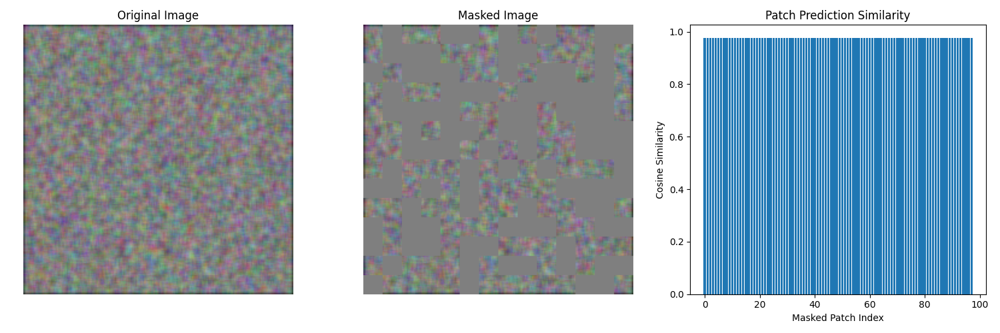
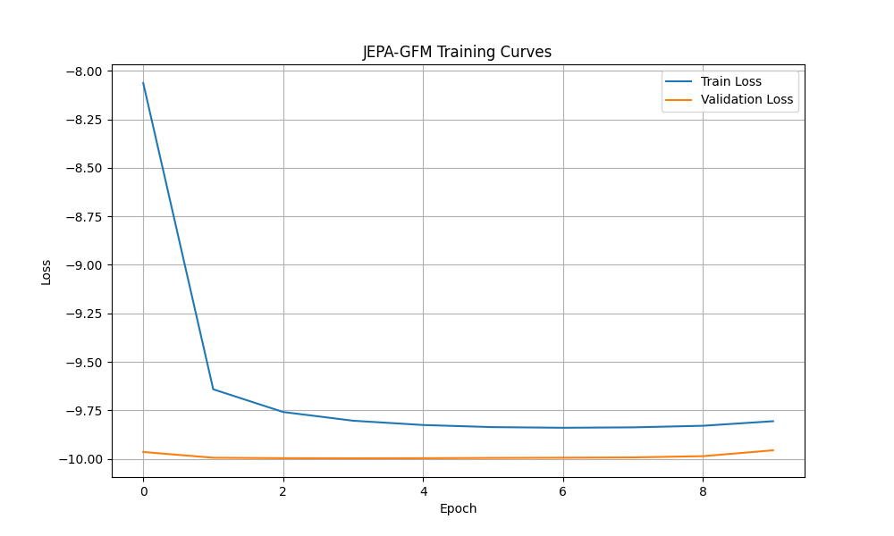

# JEPA-GFM: Joint Embedding Predictive Architecture for Geospatial Foundation Model  
*A GeoSpatial Foundation Model for Child-Centered Climate Risk Analysis*

## 🌍 Overview

This repository contains a **Proof of Concept (PoC)** implementation of **JEPA-GFM**, a geospatial foundation model based on the **Joint Embedding Predictive Architecture (JEPA)**. Unlike traditional computer vision models, JEPA-GFM is designed to handle **heterogeneous geospatial data** — including rasters, vectors, and tabular indicators — enabling seamless alignment across **different resolutions, formats, and spatial references**.

The model was developed as part of the **UN Hackathon Challenge 2: Solving the “Geo-Puzzle”**, aimed at addressing critical gaps in combining **multi-hazard data layers** with **child vulnerability factors**. By learning universal representations of geospatial inputs, JEPA-GFM enables **automated spatial reconciliation**, **scenario modeling**, and **real-time risk intelligence** that can be integrated into tools like **Giga Spatial** and **CCRI-DRM dashboards**.

## 📊 Example Training Results



## 🔍 Key Objectives

- ✅ Solve the "Geo-Puzzle": Harmonize mismatched geospatial datasets (raster weather forecasts, vector infrastructure points, administrative-boundary child poverty rates)
- ✅ Build a reusable, self-supervised geospatial foundation model
- ✅ Enable plug-and-play decoders for downstream tasks (e.g., child exposure scoring, flood impact simulation)
- ✅ Integrate with Giga Spatial for ingestion and preprocessing
- ✅ Visualize results via CCRI-DRM-compatible dashboards

---

## 🏗️ Architecture

JEPA-GFM adapts the **V-JEPA framework** from vision AI to the geospatial domain. It learns high-level representations of diverse spatial data without requiring labeled examples. The architecture includes:

1. **Context Encoder**: Encodes visible parts of geospatial data (weather maps, rasters, etc.)
2. **Target Encoder**: Maintains target representations using exponential moving average (EMA) updates
3. **Predictor Network**: Learns to predict masked region representations from context
4. **Decoder Modules**: Lightweight task-specific heads for:
   - Child exposure scoring
   - Flood-child overlay analysis
   - Uncertainty quantification
   - Scenario modeling

### Key Features

- **Multi-modal input support**: Raster, vector, and tabular data
- **Self-supervised learning**: No need for labeled training data
- **Latent space alignment**: Enables cross-format comparison
- **Modular design**: Easy integration with Giga Spatial and CCRI-DRM

---

## 🚀 Getting Started

### Installation

1. Clone this repository:
```bash
git clone <repository-url>
cd jepa-gfm
```

2. Create a virtual environment:
```bash
python -m venv .venv
source .venv/bin/activate  # On Windows: .venv\Scripts\activate
```

3. Install dependencies:
```bash
pip install -r requirements.txt
```

### Quick Start

#### 1. Generate Synthetic Data
```bash
python generate_data.py
```
Generates synthetic geospatial layers simulating hurricane paths, school locations, and child population density.

#### 2. Train the Model
```bash
python train.py
```
Trains JEPA-GFM encoder on synthetic geospatial data.

#### 3. Test the Model
```bash
python test.py
```
Validates modality fusion, resolution handling, and embedding quality.


## 🎯 Demo Use Case: Hurricane Risk for Children

JEPA-GFM can be tested in a simulated scenario involving hurricane risk in **Saint Kitts and Nevis**:

1. **Input Layers**:
   - ECMWF hurricane forecast tracks (raster)
   - WorldPop child population data (raster)
   - School locations (point vector)
   - Administrative boundaries (polygon vector)

2. **Output**:
   - Estimated number of children exposed to storm surge
   - Heatmap of high-risk zones with uncertainty estimates

---

## 🧪 Technical Highlights

| Feature | Description |
|--------|-------------|
| **Modalities Supported** | Raster (weather, elevation), Vector (points, polygons), Tabular (indicators) |
| **Self-Supervised Objective** | Latent-space prediction of masked regions |
| **Resolution Support** | Handles 128x128 to 512x512 pixel inputs |
| **Model Sizes** | Small (~25M), Base (~85M), Large (~300M) |
| **Training Strategy** | AdamW optimizer, EMA updates, patch masking |

---

## 📊 Evaluation & Limitations

### Current Capabilities
- ✅ Self-supervised pre-training on synthetic geospatial data
- ✅ Modular decoder architecture for task-specific inference
- ✅ Integration with Giga Spatial data format
- ✅ Proof-of-concept visualization in Geosight-compatible dashboards

### Known Limitations
- ⚠️ Uses synthetic data due to time constraints (hackathon setting)
- ⚠️ Limited to static spatial data (no time-series or temporal modeling yet)
- ⚠️ Not yet deployed with real-time weather APIs (ECMWF/DWD)
- ⚠️ Uncertainty quantification needs refinement

---

## 🚧 Future Work

- ✅ Integrate with live weather feeds (ECMWF/DWD)
- ✅ Add time-series modeling capabilities
- ✅ Improve uncertainty visualization for non-experts
- ✅ Expand decoder modules for other hazards (droughts, landslides)
- ✅ Optimize for deployment within UNICEF's operational workflows

---

## 📚 References

1. **I-JEPA**: Assran, M., et al. *Self-Supervised Learning from Images with a Joint-Embedding Predictive Architecture.* CVPR 2023.
2. **V-JEPA**: Bardes, A., et al. *Revisiting Feature Prediction for Learning Visual Representations from Video.* arXiv 2023.
3. **Vision Transformer**: Dosovitskiy, A., et al. *An Image is Worth 16x16 Words: Transformers for Image Recognition at Scale.* ICLR 2021.
4. **Giga Spatial Documentation**: [https://unicef.github.io/giga-spatial/](https://unicef.github.io/giga-spatial/)
5. **CCRI-DRM Dashboard**: [Geosight Portal](https://geosight.org/)


## 📄 License

This project is released under the MIT License for educational and research purposes. Please ensure compliance with licensing requirements when integrating real geospatial datasets or deploying in production environments.

---

## 💬 Contact

For questions or collaboration opportunities, please reach out to us:
- **Kerod Woldesenbet** – kerod5858@gmail.com  
- **Abem Woldesenbet** – abemkibatu101@gmail.com  

Or contact the challenge owner:
- **Yves Jaques** – yjaques@unicef.org (UNICEF DAS Computational Analytics and Geospatial Intelligence Unit)

---

## 🎉 Acknowledgments

Special thanks to:
- UNICEF and ITU for supporting initiatives like **Giga Spatial** and **CCRI-DRM**
- The UN Hackathon organizers for providing this opportunity
- The open-source community for foundational libraries like PyTorch, GeoPandas, and H3